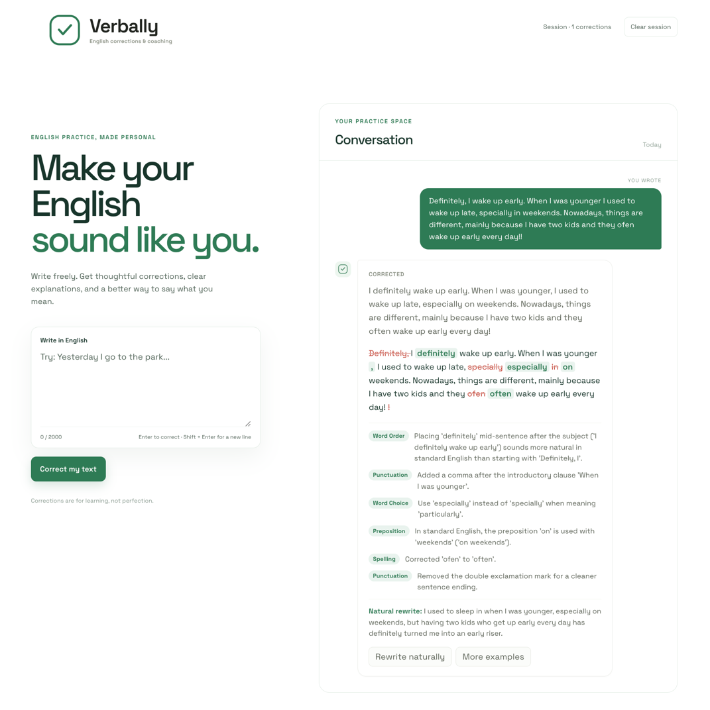

# Verbally

Verbally é uma aplicação Laravel para correção de inglês com apoio de IA. A
interface principal fica na página inicial e permite enviar um texto, receber a
correção em streaming, ver detalhes estruturados da revisão e pedir
seguimentos como reescrita natural ou um exemplo curto.

## Funcionalidades

- Correção de texto em inglês com streaming.
- Exibição de detalhes da correção com diff estruturado.
- Ações de acompanhamento:
  - reescrita natural;
  - exemplo curto relacionado à correção.
- Bloqueio de sessão enquanto uma operação está em andamento.
- Limite de 20 correções concluídas por sessão.
- Tratamento de erros recuperáveis, incluindo falta de configuração, timeout,
  limite de taxa e respostas inválidas do provedor.

## Captura



## Requisitos

- PHP `^8.3`
- Composer
- Node.js e npm
- Laravel `13`
- Livewire `4`
- Uma configuração válida do provedor Gemini usada pelas ações de IA do
  projeto

## Configuração

O projeto lê as seguintes variáveis de ambiente relacionadas à IA no .env:

```env
GEMINI_API_KEY=AQ.XXXXXXXXXXXXXXXXXXXXXXX # https://aistudio.google.com/api-keys
VERBALLY_GEMINI_MODEL=gemini-flash-latest # Modelo desejado
VERBALLY_AI_TIMEOUT_SECONDS=120 # timeout
```

## Instalação

```bash
composer install
cp .env.example .env
php artisan key:generate
php artisan migrate
npm install
```

## Desenvolvimento

O `composer.json` já expõe os comandos principais do projeto:

```bash
composer run setup
composer run dev
composer test
```

O comando `composer run dev` sobe a aplicação com servidor, fila, logs e
Vite em paralelo.

## Testes

```bash
composer test
```

Os testes cobrem a rota inicial, a lógica das ações de IA e o fluxo de browser
da interface.

## Estrutura relevante

- `routes/web.php`: rota principal da aplicação.
- `app/Actions/GenerateCorrection.php`: gera a correção em streaming e valida
  os detalhes estruturados.
- `app/Actions/GenerateFollowUp.php`: gera os seguimentos de reescrita e exemplo.
- `app/Ai/`: agentes, prompts e runtime de IA.
- `resources/views/pages/index/`: página principal Livewire da aplicação.
- `resources/views/components/`: componentes reutilizáveis da interface.
- `tests/Feature/`: testes das ações e da rota.
- `tests/Browser/`: fluxo end-to-end da interface.

## Licença

MIT. O repositório declara `license: "MIT"` em `composer.json`.
